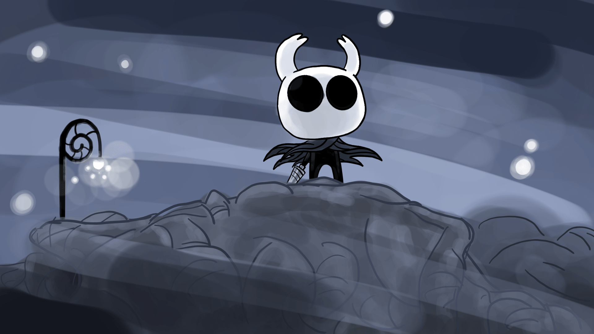

<!-- BANNER -->

  

<!-- TITLE -->

  

 

<!-- CONTACT -->

 

---

**Computer Science Student — 3/8**

> *"Focus. The nail and the mind must become one."*

Cursando **Ciências da Computação**, construindo projetos reais e aprofundando conhecimentos em desenvolvimento de software, sistemas operacionais Linux e arquitetura de computadores.

Tenho experiência com **HTML**, **CSS**, **PHP**, **C**, **C++**, **Python**, **JavaScript**, **Git** e atualmente explorando **Docker & Linux avançado**.

 

---

## Technologies

---

## Statistics

  

---

## 📜 Contribution Graph

---

## 🕯️ Benches Rested — Educação

| | Curso | Status |
|:---:|:---|:---:|
| ◈ | Ciências da Computação — Graduação | 🔄 Em andamento (3/8) |

---

*† Focus. The nail and the mind must become one. †*

